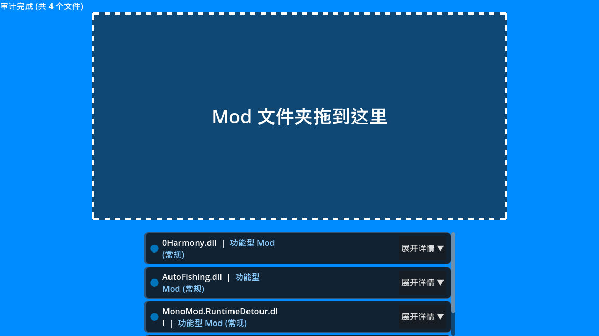

# 🛡️ D.M.I. - DotNet Mod Inspector
> **原名：Duckov Mod Inspector**
>
> **"See what your mods can do." (看看你的 Mod 到底能干什么)**

  

**D.M.I.** 是一个针对 Unity/C# 游戏模组（Mods）的**静态行为审计工具**。

它不像传统杀毒软件那样只通过“病毒库”匹配，而是像 **Android/iOS 的权限管理系统** 一样，深入扫描 `.dll` 文件内部，将模组的**潜藏能力**（联网、读写文件、执行命令等）直观地展示给你，把**知情权**还给玩家。

**支持游戏：** 适用于所有基于 C#/.NET 的游戏（如《逃离塔科夫(SPT/Live)》、《致命公司 (Lethal Company)》、《城市：天际线 2》、《戴森球计划》等）。

---

## ✨ v1.6.1 核心特性 (New!)

### 1. 👻 幽灵引用检测 (Ghost Reference)
**告别虚假焦虑。**
很多 Mod 作者因为使用通用模板，会声明 `System.Net` 等高危库但实际并未编写任何联网代码。
- D.M.I. 能自动识别这种“懒惰作者”行为，并将这些未使用的权限标记为**灰色幽灵图标** (👻)，让你一眼排除误报。

### 2. 📦 智能抗误报 (Smart Entropy)
**不再“一刀切”。**
传统工具常将包含大量图片/数据的 Mod 误判为“加密混淆”。
- D.M.I. 引入了二次核查算法。如果检测到高熵值但保留了清晰的代码特征，会标记为 **[📦 体积较大/Resource Heavy]** 而非高危混淆。

### 3. 🧠 意图推理引擎 (Context Engine)
单纯的“联网权限”并不可怕，可怕的是它连去哪。
- **智能分析**：如果检测到 `Socket` + `127.0.0.1`，DMI 会告诉你这是**“本地小地图服务”**。
- **风险识别**：如果检测到 `Socket` + `cmd.exe`，DMI 会报警这是**“远程控制木马”**。

### 4. 📱 现代化仪表盘
引入卡片式设计与行内注解 (Inline Context)，将复杂的代码行为翻译为人类可读的风险提示。

---

## 🚀 如何使用

1.  下载最新版本的 `D.M.I.exe`。
2.  运行程序。
3.  将你下载的 **Mod 文件夹** 或 **.dll 文件** 直接拖入 DMI 窗口。
4.  查看生成的权限审计报告。

---

## 🚦 如何解读报告

| 状态图标 | 含义 | 建议操作 |
| :--- | :--- | :--- |
| 🔵 **功能型 (常规)** | 包含常见 API 调用，如基础文件读写。 | 属于 Mod 正常功能，未发现异常。 |
| ✅ **未检测出敏感权限** | 扫描未发现任何高危 API 调用。 | 极其干净的代码。 |
| ⚠️ **需注意 (Warning)** | 包含敏感权限（如读取 SteamID、Socket 连接、反射）。 | **建议人工复核**。确认该 Mod 的功能是否需要这些权限。 |
| 🚫 **高风险 (Danger)** | 发现明确的恶意特征（如 Webhook 偷号、挖矿、IP 追踪）或恶意混淆。 | **建议立即删除**。除非你完全信任该作者。 |
| 👻 **幽灵引用 (Ghost)** | 声明了权限库但未使用。 | **通常安全**。这是作者开发习惯不佳造成的残留。 |
| 📦 **体积较大 (Resource)** | 包含大量内嵌资源导致熵值升高。 | **低风险**。通常是包含了图片或数据表。 |

---

## 🔍 技术细节 (For Geeks)

D.M.I. 对 `.dll` 二进制文件进行异步静态分析，主要关注以下五大维度：

* **🌐 Network (网络)**: 扫描 `HttpClient`, `Socket`, `UnityWebRequest` 及硬编码 URL。
* **📂 FileSystem (文件)**: 扫描文件读写、删除以及 `Environment.GetFolderPath`（敏感路径）。
* **⚙️ System (系统)**: 扫描 `Process.Start` (启动外部 EXE), `Registry` (注册表操作)。
* **🎭 Reflection (反射)**: 扫描 `Method.Invoke`, `Assembly.Load`。
* **🆔 Privacy (隐私)**: 扫描针对 `SteamID`, `Session`, `Wallet` 等敏感信息的读取操作。

---

## ⚠️ 免责声明 (Disclaimer)

1.  **辅助工具**：D.M.I. 是一个基于**静态特征分析**的审计工具。结果显示为“未检测出敏感权限”**并不代表**该文件绝对安全（无法检测运行时动态生成的逻辑炸弹）。
2.  **使用责任**：本工具旨在提供透明信息辅助决策。因使用 Mod 产生的任何后果（包括但不限于数据丢失、账号封禁）需由用户自行承担。
3.  **误报可能**：某些高级 Mod（如大型联机插件）确实需要大量敏感权限，请结合意图分析提示进行判断。

---

## 🤝 贡献与反馈

本项目旨在为玩家社区建立第一道防线。
如果你发现了新的恶意 Mod 变种，或者 D.M.I. 出现了误报，请提交 Issue 反馈，帮助我们更新规则库。

**Made with ❤️ by Godot Engine**
